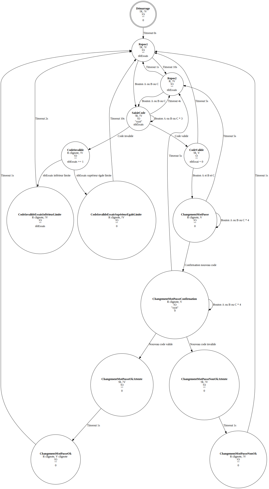

# TP01 - SécurITé

## 1 - Directives

### 1.1 - Déroulement du TP

- Le projet est réalisé en équipe de 2 personnes
- Vous devez utiliser Git pour gérer vos sources
- Vous devez utiliser SharePoint pour gérer votre document de rapport (Onglet "Fichiers" de votre équipe Teams)
- La remise du travail doit être effectuée sur et à la date indiquée sur la plateforme d'enseignement Omnivox

### 1.2 - À remettre sur la plateforme d'enseignement

- Un document word contenant le détail du projet
- Votre code source
- Le lien YouTube de votre vidéo de présentation

### 1.3 - Structure de la remise

- Vous devez remplir le fichier "AUTHORS.md".
  Il donne le nom et matricule des membres de l'équipe.
- Votre code source doit être dans le répertoire  ```src``` du présent dépôt Git
- Le répertoire source doit suivre la structure d’un projet Platform.io
- Vous devez fournir une vidéo de 5 minutes illustrant le circuit, le code et le fonctionnement :
  - La vidéo doit être déposée sur Youtube avec une option de partage « non listée »
  - Le lien de la vidéo doit être indiqué dans le document word AINSI QUE dans le fichier "AUTHORS.md"

- Le répertoire "documents" doit contenir votre rapport de TP

### 1.4 - Évaluation

L'évaluation du travail est effectuée par les enseignants de l'UE en se basant sur :

- L'historique de Git et de Teams/Sharepoint font office de référence pour évaluer la proportion du travail effectué par chaque équipier

- La qualité et le contenu du code source :

  - Conformité du code et des normes d'écriture utilisées dans le cours
  - Fonctionnalité du code
  - Facilité de lecture du code
  - Modularité
  - Modèle objet
  - Paramétrisation du code
  - Utilisation de constantes
  - Utilisation de fichiers de configuration
  - etc.

- La qualité et le contenu du document word :
  
  - Français
  - Schéma
  - Clarté et précision des explications
  - Mise en page
  - Page de présentation
  - etc.

- La qualité et le contenu de la présentation vidéo :

  - Vidéo
  - Audio
  - Explication orale
  - etc.

Tout partage de code, d'explication, de bouts de texte, etc. est considéré comme du plagiat. Pour plus de détails, consultez le site (et ses vidéos) [Sois intègre du Cégep de Sainte-Foy](http://csfoy.ca/soisintegre) ainsi que [l'article 6.1.12 de la PÉA](https://www.csfoy.ca/fileadmin/documents/notre_cegep/politiques_et_reglements/5.9_PolitiqueEvaluationApprentissages_2019.pdf)

## 2 - Description du projet

La startup SécurITé est une startup qui propose un service de sécurité pour les entreprises. Elle est spécialisée dans la sécurité des serrures. Elle veut se lancer dans le numérique et proposer un modèle électronique basée sur un code. Le code est constitué de quatre (4) lettres prises dans l'alphabet 'A', 'B', 'C'.

Votre tâche générale consiste à mettre en place une première version du programme qui permet de gérer et de saisir un code de sécurité. De manière grossière, si le code est correct, la serrure se déverrouille (DEL verte allumée). Si le code est incorrect, la serrure reste verrouillée (DEL rouge allumée). Le détail des différents états est donné ci-après.

Ce système comprend :

- Un ensemble de DELs
- Trois boutons poussoirs, chacun représenté par les symboles 'A', 'B', 'C'.

### 2.1 - Procédures pour déverrouiller la serrure

Si la serrure est verrouillée, elle est en mode saisie de code. Afin de montrer que la serrure est en fonction, une DEL rouge est allumée un fois toute les dix (10) secondes pendant une (1) seconde.

L'utilisateur saisie ses quatre (4) lettres dans l'ordre du code à l'aide des trois (3) boutons poussoirs. Si le code est correct, la DEL rouge s'éteint et la DEL verte s'allume afin de montrer que la serrure est déverrouillée. L'état déverrouillée n'est actif que pendant cinq (5) secondes. Une fois les cinq (5) secondes passées, la DEL verte s'éteint et la DEL rouge s'allume.

Si le code saisi n'est pas correct, la DEL rouge clignote pendant quelques deux (2) secondes à une fréquence de deux (2) Hz.

Au bout de trois (3) tentatives infructueuses, la DEL rouge clignote pendant dix (10) secondes à une fréquence de deux (2) Hz. Le compteur de tentatives est alors réinitialisé. Ce compteur est aussi réinitialisé à chaque saisie correct du code.

La saisie doit pouvoir s'effectuer en quatre (4) secondes maximum.

La serrure reste déverrouillée durant cinq (5) secondes.

**ATTENTION, la saisie doit pouvoir s'effectuer même pendant les clignotements des DELs.**

### 2.2 - Modification du code

Pour modifier le code, le client doit déverrouiller la serrure. Il doit appuyer simultanément sur les trois (3) boutons poussoirs pendant deux (2) secondes. Il dispose de cinq (5) secondes pour effectuer son choix. La DEL verte clignote alors à une fréquence de deux (2) Hz pendant cette période. L'utilisateur relâche ensuite les trois (3) boutons. Pour valider son choix, il peut alors taper les quatre (4) lettres du code une première fois. La DEL verte reste allumée une (1) seconde et se remet à clignoter à une fréquence de deux (2) Hz. Le client répète le nouveau code. Si le code est correct, la DEL verte et la DEL rouge clignote pendant une (1) seconde à une fréquence de deux (2) Hz et le nouveau code est en fonction. Si la deuxième saisie n'est pas la même que la première, la DEL rouge reste allumée pendant une seconde et le nouveau code n'est pas pris en compte. Ce cylce pourra être refait sinon le mode de base est repris.

### 2.3 - Diagramme et tableau machine état fini

- Légende des symboles dans uen bulle-état: R: rouge; V: verte; O: serrure ouverte; nombre d'essais
- Légende préfixé par !: inverse


|   | **Nombre transitions** | **Démarrage** | **Repos1** | **Repos2** | **SaisieCode** | **CodeValide** | **CodeInvalide** | **CodeInvalideEssaisInférieurLimite** | **CodeInvalideEssaisSuppérieurEgaleLimite** | **ChangementMotPasse** | **ChangementMotPasseConfirmation** | **ChangementMotPasseOkAttente** | **ChangementMotPasseOk** | **ChangementMotPasseNonOkAttente** | **ChangementMotPasseNonOk** |
|---|---|---|---|---|---|---|---|---|---|---|---|---|---|---|---|
| **Démarrage** | 1 |   | _Timeout 0s_ |   |   |   |   |   |   |   |   |   |   |   |   |
| **Repos1** | 2 |   |   | _Timeout 10s_ | Bouton A ou B ou C |   |   |   |   |   |   |   |   |   |   |
| **Repos2** | 2 |   | _Timeout 1s_ |   | Bouton A ou B ou C |   |   |   |   |   |   |   |   |   |   |
| **SaisieCode** | 4 |   |   | _Timeout 4s_ | Bouton A ou B ou C * 3 | Code valide | Code invalide |   |   |   |   |   |   |   |   |
| **CodeValide** | 2 |   | _Timeout 5s_ |   |   |   |   |   |   | Bouton A et B et C |   |   |   |   |   |
| **CodeInvalide** | 2 |   |   |   |   |   |   | nbEssais inférieur limite | nbEssais supérieur égale limite |   |   |   |   |   |   |
| **CodeInvalideEssaisInférieurLimite** | 1 |   | _Timeout 2s_ |   |   |   |   |   |   |   |   |   |   |   |   |
| **CodeInvalideEssaisSuppérieurEgaleLimite** | 1 |   | _Timeout 10s_ |   |   |   |   |   |   |   |   |   |   |   |   |
| **ChangementMotPasse** | 3 |   |   | _Timeout 5s_ |   |   |   |   |   | Bouton A ou B ou C * 4 | Confirmation nouveau code |   |   |   |   |
| **ChangementMotPasseConfirmation** | 4 |   |   | _Timeout 5s_ |   |   |   |   |   |   | Bouton A ou B ou C * 4 | nouveau code valide |   | nouveau code invalide |   |
| **ChangementMotPasseOkAttente** | 1 |   |   |   |   |   |   |   |   |   |   |   | _Timeout 1s_ |   |   |
| **ChangementMotPasseOk** | 1 |   | _Timeout 2s_ |   |   |   |   |   |   |   |   |   |   |   |   |
| **ChangementMotPasseNonOkAttente** | 1 |   |   |   |   |   |   |   |   |   |   |   |   |   | _Timeout 1s_ |
| **ChangementMotPasseNonOk** | 1 |   | _Timeout 2s_ |   |   |   |   |   |   |   |   |   |   |   |   |

### 2.4 - Considérations techniques

- À la première utilisation de votre serrure, le code est "ABCA"
- Le nouveau code doit être enregistré dans votre EEPROM et rechargé à chaque démarrage de votre serrure

## 3 - Description détaillée du document à remettre

Le document word doit décrire le contexte du projet, sa planification, la répartition des tâches avec un registre des heures passées, les schémas du montage, les diagrammes UML pertinents ainsi que l'inventaire des composants et une estimation des coûts pour une pompe.

## 4 - Répartition des points

1. Document word : (35%)
   - Contexte du projet (5%)
   - Planification, attribution des tâches (5%)
   - Description des étapes du projet (5%)
   - Diagramme de classes (5%)
   - Schéma du montage (5%)
   - Inventaire des pièces et évaluation du coût (5%)
   - Registre des heures consacrées au projet (5%). Le registre doit indiquer la répartition des tâches. Le registre doit montrer les tâches respectives que chaque personne aura fait avec le nombre d’heures par tâche.

2. Vidéo de 5 minutes illustrant le fonctionnement (15%)
   - Présentation rapide du circuit (5%)
   - Présentation rapide de la structure du code et des choix de conception (5%)
   - Présentation du fonctionnement (5%)

3. Code (50%)
   - Bon fonctionnement du programme (30%)
     - Saisie correct des codes
     - Animation des DELs pour le verrouillage, déverrouillage et saisie du nouveau code
     - Modification du code
     - Sauvegarde du code
   - Respect des bonnes pratiques de programmation modulaire et orientée objet (20%)
